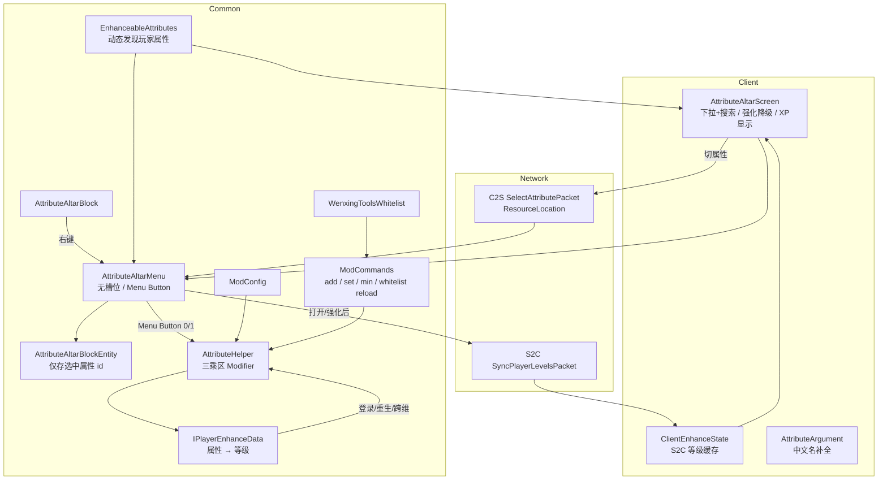

# 属性强化祭坛（Attribute Arch）设计文档

| 项 | 值 |
|---|---|
| Minecraft | 1.20.1 |
| 加载器 | Forge 47.4.0 |
| Java | 17 |
| 映射 | official 1.20.1 |
| mod_id | `attributearch` |
| 作者 | wenxing |
| 包名 | `com.example.attributearch` |
| mod 版本 | **1.1.0** |
| 状态 | 已实现 |
| 构建产物 | `build/libs/attributearch-Forge-1.20.1-1.1.0.jar` |

> 本文与仓库当前实现对齐。修改记录见 **§9**。

---

## 1. 设计目标

1. 提供可放置的**属性强化祭坛**方块，右键打开强化界面。
2. 玩家用**经验等级**强化自身属性（不消耗物品）。
3. 每个属性独立等级；三乘区同时加成；登录/重生后保留。
4. 默认列出玩家身上**全部已挂载属性**（含其他模组）。
5. 提供管理指令 `/attributearch add|set|min`，支持注册表 id 与服务端语言显示名。
6. 提供**附魔强化祭坛**：无书架、确定性附魔、可改可移、可对书附魔、免费满耐久修理。

### 非目标

- 属性祭坛：不引入材料槽 / 钻石消耗；不做 JEI / 配置 GUI（仅 TOML）；降级不退经验；暂无 `get` 查询。
- 附魔祭坛：不做原版随机三条选项；不做书架能量 UI；v1 不单独权限列表。

---

## 2. 玩法规则

### 2.1 核心循环

```
放置祭坛 → 右键打开面板 → 搜索/选择属性 → 点击「强化」
  → 扣除经验等级 → 该属性等级 +1 → 三乘区 Modifier 立即生效
  → 可点「降级」免费回退（最低 Lv.0，不退经验）
```

### 2.2 强化数值（默认，可配置）

对属性等级 `L`（`L >= 1` 时挂 Modifier）：

| 乘区 | 原版 Operation | 公式 | 默认 Lv.5 合计 |
|------|----------------|------|----------------|
| 加法 | `ADDITION` | `baseAdditionPerLevel × L` | +100 |
| 乘法 | `MULTIPLY_BASE` | `baseMultiplierPerLevel × L` | +1.0 |
| 独立乘法 | `MULTIPLY_TOTAL` | `baseIndependentMultiplierPerLevel × L` | ×1.0 |

默认每级：加法 **+20**，乘法 **+0.2**，独立乘法 **×0.2**。

GUI「下一级」一行展示的是**下一等级的累计值**（即 `addAmount(L+1)` 等），不是单级增量。

### 2.3 经验消耗

升到等级 `L` 需要：`xpCostPerLevel × L` 级经验（`Math.max(1, …)`）。

| 目标等级 | 默认消耗 |
|----------|----------|
| 1 | 10 |
| 2 | 20 |
| 3 | 30 |
| 4 | 40 |
| 5 | 50 |

- 不足时强化按钮禁用，服务端二次校验并提示「需要 N 级经验」。
- **降级**：不消耗、也不退还经验。

### 2.4 其它规则

| 规则 | 行为 |
|------|------|
| 每属性独立等级 | 是 |
| 死亡 | 默认保留（`keepOnDeath`） |
| 可选属性 | 默认玩家全部属性（含模组）；可用黑名单排除 |
| 满级 | 强化按钮禁用 |
| 距离 | 与原版容器一致，过远自动关闭 |
| 音效 | 强化 `enchantment_table.use`；降级 `villager.no` |

### 2.5 合成配方（属性强化祭坛）

工作台 **有序合成**，产出 `attributearch:attribute_altar` ×1。  
数据文件：`src/main/resources/data/attributearch/recipes/attribute_altar.json`。

**摆放（3×3，上→下）：**

```text
  铁锭  钻石  铁锭
  金锭  书    金锭
  石头  石头  石头
```

| 槽位符号 | 物品 | 数量 |
|----------|------|------|
| I | `minecraft:iron_ingot` 铁锭 | 2 |
| D | `minecraft:diamond` 钻石 | 1 |
| G | `minecraft:gold_ingot` 金锭 | 2 |
| B | `minecraft:book` 书 | 1 |
| S | `minecraft:stone` 石头（原石烧制后的石头，不是圆石） | 3 |

- 配方类型：`minecraft:crafting_shaped`；图案字符串 `IDI` / `GBG` / `SSS`。
- 创造模式可直接从「强化祭坛」标签页拿取祭坛，无需材料。
- 破坏已放置的祭坛：按战利品表掉落自身（`survives_explosion`）。

### 2.6 附魔强化祭坛（enchanting_altar）

与属性祭坛同族设施，强化**物品附魔**（ItemStack），不是玩家属性。

#### 固定规则（不可配置）

| 规则 | 固定值 |
|------|--------|
| 书架 / 附魔能量 | **0**，UI 不出现书架计数 |
| 修理 | 任意可损物品；**0 经验**；一次 **100%** 耐久 |
| 修改已有附魔 | **ALL**（可追加、升满、移除） |
| 附魔书 | **允许**（放入普通书 → 确认后变附魔书） |
| 铁砧惩罚 | **不增加** `RepairCost` |
| 类型过滤 | 诅咒 / 宝藏 / 铁砧专属：**允许**；`isDiscoverable()==false`：**禁止** |
| 花费 | **0～1 级**（有选中附魔时为 1，空选为 0） |
| 解锁 | 允许附魔一打开即可选到最大级 |

#### 合成（有序）

```text
  下界合金锭  附魔台      下界合金锭
  紫水晶块    属性强化祭坛  紫水晶块
  黑曜石      书架        黑曜石
```

| 符号 | 物品 |
|------|------|
| N | `minecraft:netherite_ingot` |
| E | `minecraft:enchanting_table` |
| A | `minecraft:amethyst_block` |
| I | `attributearch:attribute_altar` |
| O | `minecraft:obsidian` |
| B | `minecraft:bookshelf`（仅配方材料，摆设/GUI 无书架方块） |

#### 界面要点

与 **Enchanting Infuser** `InfuserScreen` 同表（220×185）：

- 顶部搜索框（右键清空；支持**中文名 / id / 拼音 / 首字母**；**聊天键 T** 聚焦；窗口缩放保留输入）；中部 4 行滚动附魔列表：左 **−** / 中附魔名 / 右 **+**；右侧滚动条（0–1 浮点拖动）。
- **−** 点击区与左侧 18px 按钮贴图对齐；**+** 点击区与右侧 18px 按钮贴图对齐。不可用时不绘制按钮板（Infuser visible 语义）。
- **−**：等级 >1 时降一级；等级 =1 或 **Shift+−**（按住可连降）= 从待选中移除。
- **+**：与当前已选冲突时不可点（暗色）；**Shift+** 按住可连升至最大级。
- **颜色（对齐 Infuser）**：可附魔 / 已选 = **亮色**（白字；已选行高亮底）；与已选冲突 = **暗色**（行底 dark + `0x683988`）。
- **Tooltip（对齐 Infuser）**：`名称 (等级区间)` + 可选 `.desc`/`.description`；冲突条目列出冲突附魔；诅咒/宝藏标签。
- 输入槽手工绘制槽框 UV (162,185)。
- 左侧仅 **确认**、**修理** 两个 18px 图标钮。确认钮在「待选 ≠ 物品当前附魔」时可用（含**纯移除**，空选 cost=0）；确认后清空搜索框。
- **不添加**「清/满」按钮，**不绘制**右侧花费/等级/无需书架等额外文字，**无**书架能量数字（本祭坛 power=0）。
- 槽位与 Infuser 一致：输入 (8,23)；盔甲 4 格左右侧；副手 (8,161)；玩家背包 y=103 / 热键栏 y=161。
- 操作走服务端：`ApplyEnchantPacket`（完整期望等级表，条数上限 256）/ Menu Button（修理）。
- **输入槽**：物品挂在 **BlockEntity**（NBT 持久化），关界面保留；破坏方块掉落。崩溃不再丢 GUI 内物品。
- **附魔写入语义（Infuser）**：以客户端完整期望表**替换**祭坛可管附魔；不在允许列表的附魔保留；冲突服务端再滤一次；附魔书移空 → 变回普通书。
- **创造模式**：`instabuild` 附魔花费视为可支付（对齐 Infuser）。
- 搜索过滤**不会**把玩家已 − 掉的附魔重新填回待选；仅在输入物品附魔集合变化时从物品重播种。
- GUI 贴图：`textures/gui/enchanting_altar.png`（来自 Infuser 贴图）。

#### 源码

`enchant/EnchantingHelper`、`block/EnchantingAltarBlock`、`blockentity/EnchantingAltarBlockEntity`、`menu/EnchantingAltarMenu`、`client/EnchantingAltarScreen`、`network/ApplyEnchantPacket`。

---

## 3. 界面（GUI 176×140，无物品栏）

> 对齐 NeoForge 1.21.1：**代码绘制**（不依赖 GUI 贴图）。

```
属性强化祭坛
[ 搜索框（点击/输入展开下拉；中文名/id/拼音/首字母） ]
[ 属性下拉列表（最多 6 行 + 滚动条）  或  状态面板 ]
    当前等级：x / 5
    需要 N 级经验
    下一级 +x / ×x / 独立×x
  [ 强化 ]    [ 降级 ]
    你的经验等级：N
```

- 尺寸 **176×140**；仅强化面板，**不显示玩家物品栏**（经验强化，无材料槽）。
- 顶部**常驻**搜索框；点击或输入展开下拉；再点外部/ESC 收起。
- 下拉：最多 6 行，滚轮 + 右侧滚动条拇指；长名 scissor 裁剪。
- 收起时状态面板：等级、经验花费（绿/红）、下一级三乘区、玩家 XP。
- **实际等级显示**：指令可把等级设到 `maxLevel` 以上；此时显示「当前等级：N」+「已超出配置上限」，强化钮仍按 GUI 上限禁用，降级可用。
- 创造模式（`instabuild`）强化不扣经验、按钮可点。
- 底色 `#C6C6C6`，列表 `#2A2A3A` / 悬停 `#4A4A6A` / 选中 `#3A5A8A`。

---

## 3b. 方块设计（放置对齐 Enchanting Infuser；外观沿用同族紫色石质）

| 项 | 属性强化祭坛 | 附魔强化祭坛 |
|----|--------------|--------------|
| 父类 | `BaseEntityBlock` + `EntityBlock` | 同左 |
| 朝向 | **无 `facing`**（Infuser/附魔台式全向） | 同左 |
| blockstate | 单一 `""` 变体 | 同左 |
| **canSurvive** | 下方需朝上**完整顶面**；`updateShape` 支撑被移除时变成空气（同附魔台） | 同左 |
| 模型 | `cube_bottom_top` | 同左 |
| mapColor | COLOR_PURPLE | COLOR_PURPLE |
| 硬度/抗爆 | 3.5 / 6.0 | 3.5 / 6.0 |
| 音效 | STONE | STONE |
| 掉落 | 需正确工具 | 需正确工具 |
| 活塞 | `PushReaction.BLOCK` | 同左 |
| 交互 | 右键 `sidedSuccess`；**`NetworkHooks.openScreen`**（向客户端写 BlockPos，匹配 `IForgeMenuType`） | 同左；打开后 `slotsChanged` 刷新输入 |
| 破坏 | 无容器内容 | `Containers.dropContents` 掉落输入槽 |
| 贴图 | `attribute_altar_{top,side,bottom}.png` | `enchanting_altar_{top,side,bottom}.png` |

> 放置逻辑来源：`其他/1.20.1` **Enchanting Infuser** `InfuserBlock`（继承附魔台）。  
> 已去掉先前 NeoForge 的 `HorizontalDirectionalBlock`/`facing` 四向放置。

**GUI 范围说明**：属性祭坛 GUI 为 176×140 代码绘制；**附魔强化祭坛 GUI 为 Infuser 220×185**，不采用 NeoForge 界面。

---

## 4. 系统架构



### 4.1 源码结构

```
src/main/java/com/example/attributearch/
├── AttributeArch.java               # @Mod 入口 / DeferredRegister / 网络与参数注册
├── attribute/
│   ├── AttributeHelper.java         # 三乘区 apply / tryEnhance / applyAll
│   └── EnhanceableAttributes.java   # 动态属性发现 + 显示名
├── block/AttributeAltarBlock.java
├── blockentity/AttributeAltarBlockEntity.java
├── capability/
│   ├── IPlayerEnhanceData.java
│   ├── PlayerEnhanceData.java
│   ├── PlayerEnhanceProvider.java
│   └── ModCapabilities.java
├── client/
│   ├── AttributeAltarScreen.java
│   ├── ClientModEvents.java         # MenuScreens.register
│   ├── ClientForgeEvents.java       # 登出清理缓存
│   └── ClientEnhanceState.java
├── command/
│   ├── ModCommands.java
│   ├── AttributeArgument.java
│   └── WenxingToolsWhitelist.java
├── config/ModConfig.java
├── event/PlayerEvents.java          # Cap 挂载 / Clone / Login / Respawn / Dim
├── menu/AttributeAltarMenu.java
├── network/
│   ├── ModNetwork.java              # SimpleChannel 协议版本 "1"
│   ├── SelectAttributePacket.java   # C2S
│   └── SyncPlayerLevelsPacket.java  # S2C
└── registry/                        # Block / Item / BE / Menu / CreativeTab
```

---

## 5. 关键实现

### 5.1 属性发现

- `useAllPlayerAttributes=true`（默认）：遍历 `ForgeRegistries.ATTRIBUTES`，保留 `player.getAttribute(attr) != null` 的项；结果按 `ResourceLocation.toString()` 排序，保证客户端/服务端顺序一致。
- 名称：优先 `Attribute.getDescriptionId()` 翻译（模组中文名可用），否则路径美化（去 `generic.` 前缀、下划线转空格、首字母大写）。
- 黑名单：`blacklistedAttributes`（id 字符串，忽略大小写）永不列出。
- 白名单：仅 `useAllPlayerAttributes=false` 时使用 `enabledAttributes`。

### 5.2 Modifier UUID

```
add:  UUID.nameUUIDFromBytes("attributearch:add:" + attrId)
mul:  UUID.nameUUIDFromBytes("attributearch:mul:" + attrId)
ind:  UUID.nameUUIDFromBytes("attributearch:ind:" + attrId)
```

Modifier 名称：`attributearch_add` / `attributearch_mul` / `attributearch_ind`。

每次 `apply`：先 `removeModifier` 三个 UUID，再按等级 `addPermanentModifier`；金额为 0 的乘区不挂。避免叠层。

`applyAll` 对单条失败做 `try/catch` 日志隔离，避免登录阶段异常踢人。

### 5.3 数据持久化

- Forge Capability：`IPlayerEnhanceData`，内部 `Map<ResourceLocation, Integer>`。
- Capability ID：`attributearch:player_enhance`。
- NBT：以属性 id 字符串为 key 的 int 表；`level <= 0` 时从 map 移除。
- `PlayerEvent.Clone`：`reviveCaps` 后按 `keepOnDeath || !isWasDeath` 复制，再 `invalidateCaps`。
- 登录 / 重生 / 跨维度：`AttributeHelper.applyAll` 重挂 Modifier。

### 5.4 网络

| 包 | 方向 | 作用 |
|----|------|------|
| `SelectAttributePacket` | C2S | 下拉切换；载荷为 **ResourceLocation**（非列表下标），服务端校验属性在 `enabledIds` 内后写入 Menu 下标与 BE |
| `SyncPlayerLevelsPacket` | S2C | 打开界面 / 强化·降级·指令后同步 `Map<String, Integer>` 到 `ClientEnhanceState` |

- 通道：`attributearch:main`，协议版本 `"1"`。
- 强化/降级走原版 **Menu Button**（id `0`=强化，`1`=降级），由 `AttributeAltarMenu.clickMenuButton` 处理。
- 客户端登出时 `ClientEnhanceState.clear()`。

### 5.5 祭坛方块实体

- BE 只保存 `SelectedAttribute`（字符串 id）。
- `setSelectedAttribute` 变更时 `setChanged` + `sendBlockUpdated`，客户端可同步。
- Menu 构造时：若服务端且未选中，自动落到列表第一项；并向该玩家发送一次 `SyncPlayerLevelsPacket`。

### 5.6 指令

```
/attributearch add <属性> <数值> [player]
/attributearch set <属性> <数值> [player]
/attributearch min <属性> <数值> [player]
/attributearch whitelist reload
```

| 项 | 说明 |
|----|------|
| 参数顺序 | **属性 → 数值 → 可选玩家**。玩家放在末尾，避免与属性名抢解析、Tab 列表混入玩家名 |
| 目标玩家 | 省略时对自己执行（控制台必须指定玩家）；指定时对在线玩家执行 |
| 权限 | OP 等级 **3**（`op>2`），或玩家 UUID 在 `wenxingtools_whitelist.json` |
| 配置限制 | **指令故意不受** `maxLevel` / 属性白名单黑名单 / **数值上限**约束（仅要求目标玩家身上有该属性；结果 `max(0, …)`）。管理向指令与 GUI 玩法上限分离 |
| 白名单文件 | 优先 `config/wenxingtools_whitelist.json`，回退游戏目录 / MDK 工程根；JSON 数组（UUID 字符串） |
| 白名单重载 | `/attributearch whitelist reload`（仅 OP 3） |
| 属性参数 | **优先注册表 id**（专用服务器必须用 id）。Tab 补全**插入 id**；悬停 tooltip 使用 **translatable Component**（由客户端本地化，中文界面显示「最大生命」）。解析仍接受 id、当前服务端语言下的显示名；无引号时对英文名做最长前缀匹配 |
| 补全实现 | `AttributeArgument` 通过 `ModArgumentTypes` 注册进 `COMMAND_ARGUMENT_TYPE`；节点挂 `.suggests(ask_server)`，客户端 Tab 由服务端返回补全列表 |
| 缺参 | 单独输入 `/attributearch` 或 `set\|add\|min` 时回应用法说明，而不是 Brigadier「错误的命令参数」 |
| 解析 | 支持无引号 token、双引号包裹 |
| 参数注册 | `ArgumentTypeInfos.registerByClass` **且**写入 `COMMAND_ARGUMENT_TYPE` 注册表（仅 registerByClass 时客户端命令树会丢掉属性节点，导致无补全） |
| 数值范围 | `add`/`min`：≥1；`set`：≥0；**无上限**；结果钳制 `>= 0`（不受 `maxLevel`） |
| 目标校验 | 目标玩家身上必须挂有该属性 |
| 配置 | **不受**属性白名单/黑名单/`maxLevel` 限制 |

示例：

```
/attributearch add minecraft:generic.movement_speed 2
/attributearch set minecraft:generic.max_health 5
/attributearch set minecraft:generic.max_health 5 Alice
/attributearch min minecraft:generic.luck 1 @p
/attributearch whitelist reload
```

> **多人注意**：专用服务端语言只有 `en_us`。若 Tab 曾插入中文显示名，服务端 `AttributeArgument` 无法解析，会提示未知属性。补全应使用注册表 id。

---

## 6. 配置文件

注册类型：`COMMON` → `config/attributearch-common.toml`。

```toml
# Maximum enhancement level per attribute
maxLevel = 5
# 加法乘区每级增量
baseAdditionPerLevel = 20.0
# 乘法乘区 (MULTIPLY_BASE) 每级增量
baseMultiplierPerLevel = 0.2
# 独立乘法乘区 (MULTIPLY_TOTAL) 每级增量
baseIndependentMultiplierPerLevel = 0.2
# 升到等级 L 所需经验等级 = xpCostPerLevel * L
xpCostPerLevel = 10
# true：列出玩家全部已挂载属性；false：仅 enabledAttributes
useAllPlayerAttributes = true
# 仅 useAllPlayerAttributes=false 时生效
enabledAttributes = [
  "minecraft:generic.max_health",
  "minecraft:generic.movement_speed",
  "minecraft:generic.attack_damage",
  "minecraft:generic.armor",
  "minecraft:generic.armor_toughness",
  "minecraft:generic.attack_speed",
  "minecraft:generic.luck"
]
# 永不列出的属性 id
blacklistedAttributes = []
# 死亡是否保留强化
keepOnDeath = true
```

配置在 `ModConfigEvent` 加载后拷贝到静态字段，运行时读取静态字段。

---

## 7. 注册与资源

| 类型 | ID / 路径 |
|------|-----------|
| Block / Item / BE / Menu | `attributearch:attribute_altar`、`attributearch:enchanting_altar` |
| 创造模式标签 | `attributearch:main`（「强化祭坛」，含两座祭坛） |
| 方块属性 | 硬度 3.5 / 抗爆 6.0，石质音效，需正确工具掉落 |
| 方块模型 | `cube_bottom_top`：`attribute_altar_{top,side,bottom}.png` |
| GUI | `textures/gui/attribute_altar.png`（176×150，无物品栏） |
| 语言 | `zh_cn` / `en_us` |
| 配方 | 见 **§2.5**（属性祭坛）、**§2.6**（附魔祭坛） |
| 战利品表 | 破坏掉落自身（`survives_explosion`） |

### 语言键

界面与消息使用 `gui.attributearch.*`、`message.attributearch.*`、`command.attributearch.*`、`block.attributearch.attribute_altar`、`itemGroup.attributearch`。属性显示名通过原版 `Attribute.getDescriptionId()` 获取。

---

## 8. 测试清单

| 用例 | 期望 |
|------|------|
| 右键打开 | 搜索框、状态三行、双按钮正常；无物品栏；GUI 为代码绘制 176×140 |
| 下拉搜索 | 输入中文/ID/拼音可过滤；展开盖住状态区；滚轮与滚动条正常 |
| 祭坛放置 | 下方无完整顶面无法放置/会掉落（同附魔台）；无朝向；右键开 GUI |
| 经验不足 | 强化按钮禁用；服务端提示所需经验 |
| 强化 | 扣经验，等级+1，三乘区在属性提示中变化；同步客户端缓存 |
| 降级 | 免费，最低 0，不退经验；`Villager No` 音效 |
| 死亡重生 | 等级与 Modifier 保留（默认） |
| 跨维度 | Modifier 重新挂载 |
| 指令 add/set/min | 中文名可用；可选尾置玩家；数值钳制 |
| 指令权限 | 非 OP / 未在白名单被拒绝 |
| whitelist reload | OP 可重载并回显路径与人数 |
| 模组属性 | 出现在下拉中且可强化 |
| 黑名单 | 配置后不出现在下拉 |
| 登录 | 不因 `AttributeArgument` 序列化或单条 apply 失败断线 |
| 登出再进 | 客户端等级缓存不串档 |
| 工作台合成 | 按 §2.5 摆放可合成 1 个属性祭坛；材料不足无法产出 |
| 附魔祭坛合成 | 按 §2.6 可合成 1 个附魔祭坛 |
| Tab 补全 | `/attributearch set ` + Tab 出现属性 id；悬停显示客户端语言名 |
| 缺参 | `/attributearch`、`/attributearch set` 回应用法而非裸语法错误 |
| 附魔祭坛 | 无书架可满级附魔；可对书；可修理/移除；不增加铁砧惩罚；花费 0～1 级 |
| 附魔 − 移除 | 点 − 到 0 级后确认，附魔真正撤下（含纯移除全部，cost 0）；搜索不会回填已移除项 |
| 附魔冲突显示 | 与已选冲突的条目暗色且不可 +，悬停列出冲突附魔；可附魔/已选亮色 |
| 附魔输入持久化 | 关界面物品留在祭坛；破坏方块掉落；创造可免 XP 附魔 |
| 指令超上限 | `/attributearch set/add` **无上限**，可超过 `maxLevel`；GUI 显示实际等级 |
| 祭坛支撑 | 下方方块被移除后祭坛消失（同附魔台） |

---

## 9. 修改记录

每次功能/文档变更追加一行；构建产物始终为当前源码编译结果。

| 日期 | 变更 |
|------|------|
| 2026-09-12 | 指令：缺参回应用法；Tab 补全插入注册表 id；`AttributeArgument` 写入 `COMMAND_ARGUMENT_TYPE`（修复专用服无补全）；tooltip 改为 translatable（悬停显示中文名） |
| 2026-09-12 | 文档：补充 §2.5 合成配方说明与修改记录；测试清单增加合成/补全用例 |
| 2026-09-12 | **新增附魔强化祭坛** `enchanting_altar`：无书架确定性附魔、可对书、免费满耐久修理、移除附魔、不增铁砧惩罚；配方/模型/语言/GUI；`ApplyEnchantPacket`；创造栏改名「强化祭坛」 |
| 2026-09-12 | 附魔祭坛 UI 借鉴 Fuzss **Enchanting Infuser 1.20.1** `InfuserScreen`：220×185、顶部搜索、4 行滚动附魔列表（左减/右加）、左侧 18px 图标钮；**去掉书架计数**（本设计 power=0） |
| 2026-09-12 | 本地 `其他/1.20.1` Infuser 源码到位后二次对齐：官方 GUI 贴图、槽位 (8,23)/(30,103/161)、`ImageButton` 附魔/修理图标钮、列表行 UV、滚动条；无书架能量区 |
| 2026-09-12 | 精简附魔祭坛 GUI：去掉「清/满」按钮与右侧花费/等级/无需书架文字，仅保留 Infuser 本体控件（搜索+列表+确认/修理） |
| 2026-09-12 | 附魔祭坛：补上盔甲栏+副手（Infuser 布局）；Shift 一键满级/取消；搜索支持拼音与首字母（`EnchantPinyin`） |
| 2026-09-12 | 属性祭坛下拉搜索支持**拼音与首字母**（`AttributePinyin`），与附魔祭坛搜索体验一致 |
| 2026-09-12 | 附魔祭坛 Shift 转移：从附魔槽移出时优先回**对应盔甲/副手槽**（与 Infuser 一致），再进背包；从其他槽 Shift 仅进入空的附魔槽 |
| 2026-09-12 | 附魔祭坛：修复 **− 无法真正撤下附魔**（apply 曾与物品已有附魔合并）。改为 Infuser 式**完整期望表替换**；空选可纯移除（cost 0）；附魔书移空变回普通书；非允许列表附魔保留 |
| 2026-09-12 | 附魔祭坛：冲突附魔**暗色**行底 + `0x683988` 文字并禁用 +，悬停提示冲突对象；可附魔/已选**亮色**；−/＋ 点击区对齐 18px 按钮贴图；确认钮按「待选≠当前」启用；搜索不再回填已 − 掉的附魔 |
| 2026-09-12 | 附魔祭坛 GUI 二次对齐 Infuser：聊天键 T 聚焦搜索、resize 保留搜索词、浮点滚动条、Shift 按住连调等级、不可用时不绘制 ± 板、输入槽框 UV、tooltip「名称(等级区间)+描述」 |
| 2026-09-12 | **指令设计明确写入**：`/attributearch` **不受** `maxLevel`/白名单黑名单限制（文档 + 注释） |
| 2026-09-12 | 修复：白名单模式不再列出/强化玩家身上不存在的属性；`tryEnhance` 强制 `playerHas`；创造模式附魔免 XP；`ApplyEnchantPacket` 条数上限 256；登录 `applyAll` 将超 max 等级钳制回写 |
| 2026-09-12 | 性能/结构：`allowedFor` LRU 缓存 + `Set` 查找；属性发现 1s 按玩家缓存（登录/重生/跨维失效）；配置热更清缓存；附魔输入槽迁到 **BE 持久化**（关界面保留、破坏掉落）；属性 GUI 搜索框去掉双重绘制 |
| 2026-09-12 | **自 NeoForge 1.21.1 移植方块设计**：两祭坛改 `HorizontalDirectionalBlock`（放置朝向玩家、`facing` 四向 blockstate）；属性祭坛 mapColor 改紫；`PushReaction.BLOCK`；方块贴图自 NF 同步 |
| 2026-09-12 | **自 NeoForge 1.21.1 移植属性祭坛 GUI**：176×140 代码绘制（去旧 176×150 贴图流程）；常驻搜索 + 下拉 6 行滚动条；状态面板/XP/按钮布局对齐；保留拼音搜索与创造免 XP |
| 2026-09-12 | **附魔强化祭坛 GUI 改回**：不采用 NeoForge 界面；恢复 Infuser 220×185 贴图与既有列表交互（此前误同步 NF GUI 贴图） |
| 2026-09-12 | **方块放置对齐 Infuser**：去掉 `facing`/`HorizontalDirectionalBlock`；`canSurvive` 要求下方完整顶面（附魔台式）；右键 `sidedSuccess`；附魔祭坛打开时 `slotsChanged`；blockstate 改回单一变体 |
| 2026-09-12 | **修复 GUI 打不开**：`player.openMenu` 未写 Forge 额外数据，客户端 `IForgeMenuType` 读 BlockPos 失败；改回 `NetworkHooks.openScreen(serverPlayer, be, pos)` |
| 2026-09-12 | 指令**取消 1000 上限**；GUI 状态行显示**实际等级**（超配置上限时单独提示）；登录不再把超 max 等级钳回 |
| 2026-09-12 | 审计优化：附魔确认/修理后 `setItem` 同步客户端；祭坛 `updateShape` 支撑失效变空气；创造属性强化免 XP；`SyncPlayerLevelsPacket` 解码上限 4096；屏幕选中以 Menu DataSlot 为准 |
| 2026-09-12 | **版本升至 1.1.0**（`gradle.properties` / `mods.toml` 模板 / 本文档） |
