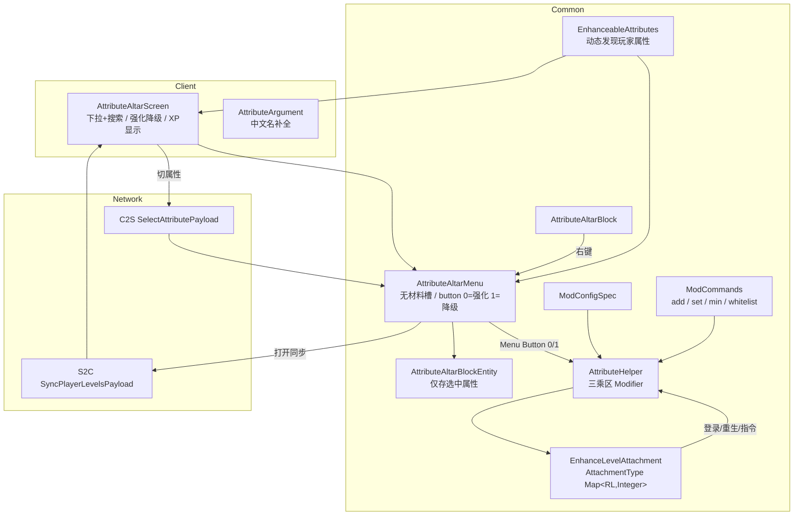

# 属性强化祭坛（Attribute Arch）设计文档

| 项 | 值 |
|---|---|
| Minecraft | **1.21.1** |
| 加载器 | **NeoForge 21.1.200** |
| Java | **21** |
| 映射 | Parchment 2024.11.17 |
| 构建插件 | ModDevGradle `2.0.146` |
| mod_id | `attributearch` |
| 作者 | wenxing |
| 包名 | `com.example.attributearch` |
| 状态 | **开发中**（`gradlew build` 通过） |
| 构建产物 | `build/libs/attributearch-NeoForge-1.21.1-1.1.0.jar` |

## 更新日志

### v1.1.0（开发中）— 附魔强化祭坛 + GUI 对齐 + 放置修复 + GUI 交互对齐 Infuser + 优化修复

> 开发阶段统一版本号 **1.1.0**，后续改动合入本版本。

- 新增方块 `attributearch:enchanting_altar`（附魔强化祭坛），与属性强化祭坛同族。
- 固定规则：书架需求 **0**；修理免费满耐久；花费 0 级；允许宝藏/诅咒/铁砧专属；禁止不可发现附魔；**不增加**铁砧惩罚。
- 网络：`attributearch:confirm_enchant`（C2S，服务端权威）。
- 合成：下界合金锭 / 附魔台 / 下界合金锭 + 紫水晶块 / 属性强化祭坛 / 紫水晶块 + 黑曜石 / 书架 / 黑曜石。
- 创造栏更名为「强化祭坛」，两祭坛并列。
- GUI：按 Enchanting Infuser **仅展示元素**——220×185；物品槽、搜索、可滚动附魔列表（`-`/`+`/Shift 拉满）、附魔/修理按钮、装备栏+背包+副手。**不再**显示清除/一键拉满/「无需书架」/额外花费文案。仍无书架 UI、花费 0、不写铁砧惩罚。
- GUI 交互对齐 Enchanting Infuser：
  - 列表行悬停提示：附魔名 + 等级范围 + 描述；冲突时显示冲突附魔；已有等级显示「当前 N」。
  - 附魔按钮悬停预览：物品名 + 新增（绿）/变更（黄）/保留（灰）/移除（红）列表 + 免费/花费。
  - 修理按钮悬停：耐久 `当前 / 上限` + 免费。
  - 宝藏金色、诅咒紫色高亮；冲突行仍置灰。
  - 搜索：窗口 resize 保留关键字；搜索聚焦时热键栏数字键可切换快捷栏（忽略文本输入）。
  - 滚动条可拖拽；确认附魔播放附魔台音效。
- **优化修复（通读后 P0/P1）**：
  - 冲突检测统一为「物品已有 + 当前选择」，UI 与 `computeResult` 同源；一键拉满避开已有互斥附魔。
  - 确认附魔失败 ActionBar 提示；音效坐标改为祭坛 `menu.getPos()`。
  - 换物品 / 确认成功后清理客户端选择。
  - `confirm_enchant` 条目上限 256，防超大包。
  - 创造模式属性强化不再扣经验（对齐原版 `instabuild`）。
  - `select_attribute` 服务端校验玩家身上存在该属性。
  - 删除公共 Helper 中的客户端死代码 `buildPreviewClient`。
  - GUI 列表/Tooltip 脏标记刷新，避免每 tick 全量重算；附魔列表排序预计算名称键。
  - Menu 按钮客户端侧改为不处理（仅服务端权威）；修理后 `setChanged`。
- 放置（对齐 Enchanting Infuser）：两祭坛改为继承 `BaseEntityBlock`，**无朝向**，blockstate 单变体；碰撞箱高 12px（同附魔台/Infuser）；`useShapeForLightOcclusion`；不可寻路；右键 `sidedSuccess` 开 GUI。不再使用 `HorizontalDirectionalBlock`（1.21.1 基类不注册 FACING，曾导致 blockstate facing 无效、像放不下）。对着已有交互方块右键会优先打开对方 GUI，**贴面放置需潜行（Shift）**。

---

## 1. 需求摘要

1. 可交互方块 **属性强化祭坛**，右键打开 GUI。
2. GUI：**可搜索下拉**选属性、**强化 / 降级**按钮、经验消耗与等级显示；**无物品栏、无物品槽**。
3. 强化消耗**玩家经验等级**（非物品）。
4. 每属性独立等级；默认最高 5 级；登录/重生保留强化。
5. **三乘区**同时加成：加法、乘法、独立乘法。
6. 默认列出玩家身上**全部属性**（含其他模组挂载的）。
7. 指令 `/attributearch add|set|min`，属性支持中文名补全与输入，可对其他玩家执行；OP 或 `wenxingtools_whitelist.json` 中的玩家可用。

---

## 2. 玩法规则

### 2.1 核心循环

```
放置祭坛 → 右键打开面板 → 搜索/选择属性 → 点击「强化」
  → 扣除经验等级 → 该属性等级 +1 → 三乘区 Modifier 立即生效
  → 可点「降级」免费回退（最低 Lv.0，不退经验）
```

### 2.2 强化数值（默认，可配置）

对属性等级 `L`：

| 乘区 | Operation | 公式 | 默认 Lv.5 |
|------|-----------|------|-----------|
| 加法 | `ADD_VALUE` | `baseAdditionPerLevel × L` | +100 |
| 乘法 | `ADD_MULTIPLIED_BASE` | `baseMultiplierPerLevel × L` | +1.0 |
| 独立乘法 | `ADD_MULTIPLIED_TOTAL` | `baseIndependentMultiplierPerLevel × L` | ×1.0 |

默认每级：加法 **+20**，乘法 **+0.2**，独立乘法 **×0.2**。

### 2.3 经验消耗

升到等级 `L` 需要：`xpCostPerLevel × L` 级经验。

| 目标等级 | 默认消耗 |
|----------|----------|
| 1 | 10 |
| 2 | 20 |
| 3 | 30 |
| 4 | 40 |
| 5 | 50 |

- 不足时按钮禁用，并提示「需要 N 级经验」。
- **降级**：不消耗、也不退还经验。

### 2.4 其它规则

| 规则 | 行为 |
|------|------|
| 每属性独立等级 | 是 |
| 死亡 | 默认保留（`keepOnDeath=true`） |
| 可选属性 | 默认玩家全部属性（含模组）；可用黑名单排除 |
| 满级 | 强化按钮禁用 |
| 距离 | 与原版容器一致，过远自动关闭 |

---

## 3. 界面（GUI 176×140，无物品栏）

```
属性强化祭坛
[ 搜索框（点击/输入展开下拉） ]
[ 属性下拉列表（最多 6 行）   或  状态面板 ]
    当前等级：x / 5
    需要 N 级经验
    下一级 +20 / ×0.2 / 独立×0.2
 [ 强化 ]    [ 降级 ]
    你的经验等级：N
```

- 强化只消耗经验等级，**不显示物品栏 / 快捷栏**，Menu 无槽位。
- 背景：原版灰底 `#C6C6C6`，不依赖自定义 GUI 贴图。
- 下拉：最多 6 行，名称/ID 过滤，滚轮滚动；展开时隐藏强化/降级按钮，列表最后绘制保证在控件之上。
- 关闭时：状态面板 → 按钮 → 经验等级。
- 交互：`mouseClicked` / `mouseScrolled` / `charTyped` / `keyPressed`；ESC 先关下拉。

---

## 4. 系统架构



### 4.1 源码结构

```
src/main/java/com/example/attributearch/
├── AttributeArch.java
├── AttributeArchClient.java           # RegisterMenuScreensEvent + ClientHooks 注入
├── attribute/
│   ├── AttributeHelper.java
│   └── EnhanceableAttributes.java
├── block/AttributeAltarBlock.java
├── block/EnchantingAltarBlock.java
├── blockentity/AttributeAltarBlockEntity.java
├── blockentity/EnchantingAltarBlockEntity.java
├── attachment/ModAttachments.java
├── client/
│   ├── AttributeAltarScreen.java
│   ├── EnchantingAltarScreen.java
│   ├── ClientGameEvents.java
│   └── ClientLevelCache.java
├── command/
│   ├── ModCommands.java
│   ├── AttributeArgument.java
│   └── Whitelist.java
├── config/ModConfig.java
├── enchant/EnchantingAltarHelper.java # 附魔过滤/冲突/固定花费/确认计算
├── event/PlayerEvents.java
├── menu/AttributeAltarMenu.java
├── menu/EnchantingAltarMenu.java
├── network/
│   ├── ClientHooks.java               # 客户端回调桥，避免专用服加载客户端类
│   ├── ModNetwork.java
│   ├── SelectAttributePayload.java
│   ├── ConfirmEnchantPayload.java
│   └── SyncPlayerLevelsPayload.java
└── registry/
    ├── ModBlocks.java
    ├── ModItems.java
    ├── ModBlockEntities.java
    ├── ModMenus.java
    ├── ModCreativeTabs.java
    └── ModArgumentTypes.java
```

资源：

```
src/main/resources/
├── META-INF/neoforge.mods.toml
├── assets/attributearch/
│   ├── blockstates/{attribute_altar,enchanting_altar}.json
│   ├── models/block/{attribute_altar,enchanting_altar}.json
│   ├── models/item/{attribute_altar,enchanting_altar}.json
│   ├── textures/block/attribute_altar_{top,side,bottom}.png
│   ├── textures/block/enchanting_altar_{top,side,bottom}.png
│   ├── textures/gui/attribute_altar.png
│   └── lang/{zh_cn,en_us}.json
└── data/attributearch/
    ├── recipe/{attribute_altar,enchanting_altar}.json
    └── loot_table/blocks/{attribute_altar,enchanting_altar}.json
```

---

## 5. 关键实现

### 5.1 属性发现

- `useAllPlayerAttributes=true`（默认）：遍历 `BuiltInRegistries.ATTRIBUTE`，保留 `player.getAttribute(attr) != null` 的项。
- 名称：优先 `Attribute.getDescriptionId()` 的 `Component.translatable` 翻译；否则对 `id.getPath()` 做美化（下划线转空格、首字母大写）。
- 黑名单 `blacklistedAttributes`：永不列出。
- 白名单 `enabledAttributes`：仅 `useAllPlayerAttributes=false` 时生效。
- 指令与 GUI 共用同一发现逻辑，保证列表一致。

### 5.2 Modifier 标识与三乘区

Modifier 使用 **ResourceLocation 键**（含属性命名空间）：

```text
加法:   attributearch:add/<ns>/<path>
乘法:   attributearch:mul/<ns>/<path>
独立:   attributearch:ind/<ns>/<path>
```

每次 `apply`：

1. 读取附件等级 `L`；
2. `L <= 0` 时 `removeModifier` 三个 id；
3. `L > 0` 时用 `addOrReplacePermanentModifier` 写入三个 `AttributeModifier`。

| Operation | 幅度（等级 L） |
|-----------|----------------|
| `ADD_VALUE` | `baseAdditionPerLevel * L` |
| `ADD_MULTIPLIED_BASE` | `baseMultiplierPerLevel * L` |
| `ADD_MULTIPLIED_TOTAL` | `baseIndependentMultiplierPerLevel * L` |

### 5.3 数据持久化（Attachment）

`AttachmentType<Map<ResourceLocation, Integer>>`，序列化为 `ListTag` 元素 `{id, level}`，兼容旧 `Compound` 格式，读失败时返回空表。

```java
player.getData(ModAttachments.ENHANCE_LEVELS);
player.setData(ModAttachments.ENHANCE_LEVELS, map);
```

事件：

| 事件 | 行为 |
|------|------|
| `PlayerEvent.Clone` | `keepOnDeath=true` 时复制；`false` 且死亡时清空 |
| `PlayerLoggedInEvent` | `AttributeHelper.applyAll(player)` |
| `PlayerRespawnEvent` | `applyAll` |
| `PlayerChangedDimensionEvent` | `applyAll` |

登录/重生事件与 `apply` 均异常隔离，避免打断 `placeNewPlayer`。

### 5.4 网络（Payload）

| 包 | 方向 | 作用 |
|----|------|------|
| `SelectAttributePayload` | C2S | 下拉切换属性；服务端写入 BE 选中项 |
| `SyncPlayerLevelsPayload` | S2C | 打开界面 / 强化后同步等级 Map + 当前经验等级 |

注册（模组总线）：

```java
@SubscribeEvent
static void registerPayloads(RegisterPayloadHandlersEvent event) {
    PayloadRegistrar registrar = event.registrar("1");
    registrar.playToServer(SelectAttributePayload.TYPE, SelectAttributePayload.STREAM_CODEC,
        SelectAttributePayload::handle);
    registrar.playToClient(SyncPlayerLevelsPayload.TYPE, SyncPlayerLevelsPayload.STREAM_CODEC,
        SyncPlayerLevelsPayload::handle);
}
```

- 强化 / 降级使用原版 **Menu Button**（`clickMenuButton`，id `0=强化`，`1=降级`），由 `AttributeAltarMenu` 在服务端执行。
- 所有服务端写等级的路径最终都调用 `AttributeHelper.apply`，保证 GUI / 指令 / 事件一致。

### 5.5 Menu / BlockEntity

- `AttributeAltarMenu`：`AbstractContainerMenu`，**无任何槽位**（经验强化，不涉及物品）。
- 选中属性存 `AttributeAltarBlockEntity`（`ResourceLocation selected`），C2S 切换后 `setChanged()`；S2C 打开时下发，便于客户端渲染。
- `Block.useWithoutItem`：`ServerPlayer.openMenu(MenuProvider)`；客户端侧由 `RegisterMenuScreensEvent` 打开 Screen。
- `stillValid`：沿用原版方块容器距离检查。

### 5.6 指令

```
/attributearch add [<player>] <属性> <数值>
/attributearch set [<player>] <属性> <数值>
/attributearch min [<player>] <属性> <数值>
/attributearch whitelist reload
```

| 项 | 说明 |
|----|------|
| 权限 | OP 等级 **3**，或 UUID 在 `config/wenxingtools_whitelist.json` |
| 白名单文件 | JSON 数组；找不到时回退游戏目录 / 工程根 |
| 属性参数 | 中文名或注册 id；Tab 补全中文名，悬停显示 id |
| 配置限制 | **指令不受** `maxLevel` / `blacklistedAttributes` / `enabledAttributes` 限制；Tab 补全同样不按配置过滤，始终列出注册表全部属性 |
| GUI 对比 | GUI 强化仍受 `maxLevel` 与经验消耗约束；指令写入后 GUI 显示「已满级」但实际等级可更高，Modifier 按真实等级计算 |
| `min` | 减少等级，最低 0；`add/set` 写入后 `apply` |
| 自定义参数类型 | `AttributeArgument` + `SingletonArgumentInfo.contextFree`，注册时必须调用 `ArgumentTypeInfos.registerByClass`，否则登录同步指令树会失败 |

示例：

```
/attributearch add 移动速度 2
/attributearch set Alice 最大生命 5
/attributearch min @p minecraft:generic.luck 1
```

### 5.7 客户端

- `AttributeArchClient`：`RegisterMenuScreensEvent` 注册 `AttributeAltarScreen`。
- 登录前在 `FMLClientSetupEvent` 注入 `ClientHooks`，S2C 同步走公共回调，专用服不加载客户端类。
- 登出：`ClientPlayerNetworkEvent.LoggingOut` 清空 `ClientLevelCache`。

---

## 6. 配置文件

`config/attributearch-common.toml`（`ModConfigSpec` COMMON）：

```toml
maxLevel = 5
baseAdditionPerLevel = 20.0
baseMultiplierPerLevel = 0.2
baseIndependentMultiplierPerLevel = 0.2
xpCostPerLevel = 10
useAllPlayerAttributes = true
blacklistedAttributes = []
# enabledAttributes 仅在 useAllPlayerAttributes=false 时生效
keepOnDeath = true
```

定义时对 `maxLevel`、`xpCostPerLevel` 设合理 `defineInRange`；`blacklistedAttributes` / `enabledAttributes` 使用 `defineListAllowEmpty`，元素为属性 id 字符串，校验可解析为 `ResourceLocation`（是否存在于注册表可在使用时宽松处理，避免其他模组后注册导致配置炸档）。

---

## 7. 注册与资源

| 类型 | ID |
|------|-----|
| Block / Item / BE / Menu | `attributearch:attribute_altar` |
| Attachment | `attributearch:enhance_levels` |
| Payload | `attributearch:select_attribute` / `attributearch:sync_levels` |
| 自定义参数类型 | `attributearch:attribute` |
| 创造模式标签 | `attributearch:main`（或按需插入原版工具/功能页签） |
| 方块贴图 | `textures/block/attribute_altar_{top,side,bottom}.png` |
| 语言 | `zh_cn` / `en_us` |
| 配方 | 属性祭坛：铁/钻石/铁 + 金/书/金 + 石×3；附魔祭坛：下界合金/附魔台/下界合金 + 紫水晶/属性祭坛/紫水晶 + 黑曜石/书架/黑曜石 |
| 战利品表 | 破坏掉落自身（`data/<ns>/loot_table/blocks/...`） |

方块行为要点：

- `BaseEntityBlock`（或等价实现 `EntityBlock`）
- `MapColor`、硬度、是否需要正确工具掉落，与原版祭坛观感一致
- 六面模型 + `blockstates` 指向单一 model 或简单朝向模型

---

## 8. 测试清单

| 用例 | 期望 |
|------|------|
| `gradlew build` | 编译通过，产出 jar |
| 右键打开 | 下拉、状态、双按钮、原版背包正常 |
| 下拉搜索 | 输入中文/ID 可过滤；列表盖住按钮且不点穿 |
| 经验不足 | 强化按钮禁用，显示所需经验 |
| 强化 | 扣经验，等级+1，属性提示中三乘区变化正确 |
| 降级 | 免费，最低 0，不退经验，Modifier 被移除 |
| 死亡重生 | `keepOnDeath=true` 时等级与 Modifier 保留 |
| 跨维度 | 重新进入后 Modifier 仍有效 |
| 指令 add/set/min | 中文名可用；可指定玩家；不受 maxLevel 限制 |
| 指令权限 | 非 OP / 未在白名单时被拒绝 |
| whitelist reload | 重载 JSON，无需重启 |
| 模组属性 | 出现在下拉中且可强化 |
| 黑名单 | 配置后不出现在下拉 |
| 登出再进 | 客户端缓存清空，服务端数据仍在 |
| 专用服务端 | 无客户端类加载；GUI/网络在联机下正常 |
| 附魔祭坛：无书架 | 无需摆放书架即可附到满级 |
| 附魔祭坛：书 | 放入普通书可生成附魔书 |
| 附魔祭坛：冲突 | 精准采集↔时运等冲突附魔互斥 |
| 附魔祭坛：修理 | 耐久未满时点击免费满耐久 |
| 附魔祭坛：移除 | 清空附魔；附魔书退回普通书 |
| 附魔祭坛：铁砧惩罚 | 确认后 RepairCost 不增加 |

---

## 9. 实现顺序建议

1. 工程元数据：`gradle.properties` 的 `mod_id` / 包名 / 名称。
2. 注册层：Block / Item / BE / Menu / CreativeTab / 配置。
3. Attachment + `AttributeHelper` + 登录/重生事件（可先用指令验证）。
4. 指令与 `AttributeArgument`（含白名单）。
5. 网络 Payload + Menu 按钮逻辑。
6. Screen + 客户端缓存与注销清理。
7. 资源（模型、贴图、语言、配方、战利品）与手测清单。

---

## 10. 非目标 / 已知边界

- 仅对挂在**玩家实体**上的 `Attribute` 生效；纯客户端展示属性不会出现。
- 降级不退还已消耗经验。
- 指令暂无 `get` 查询。
- 无 JEI 集成；配置以 TOML 为主（可选用 NeoForge `ConfigurationScreen` 作为游戏内入口）。
- 不做跨模组属性兼容特判；模组属性只要出现在玩家 `AttributeInstance` 即可被发现。
- 数据生成（datagen）可选，非首版必须。
- 附魔祭坛 v1 未做独立白名单（与属性祭坛共用/不设）；「不可发现」按标签集合判定（不在 in_enchanting_table/treasure/curse/tradeable/loot 等可获得标签内则禁止）。

---

## 11. 附魔强化祭坛（Enchanting Altar）

### 11.1 定位

| 项 | 设计 |
|----|------|
| 方块 ID | `attributearch:enchanting_altar` |
| 中文名 | 附魔强化祭坛 |
| 与属性祭坛 | 并列：一个改玩家属性，一个改物品附魔 |
| 创造栏 | 并入 `itemGroup.attributearch` |

### 11.2 固定规则（不可配置）

| 规则 | 固定值 |
|------|--------|
| 书架/附魔能量 | **0** |
| 修理 | 任意可损物品；**0 经验**；一次 **100%** 耐久 |
| 修改已有附魔 | 可追加、升满级、移除 |
| 附魔书 | **允许** |
| 铁砧惩罚 | **不增加** `RepairCost` |
| 类型 | 诅咒/宝藏/铁砧专属：允许；不可发现：禁止 |
| 花费 | **0 级**（`maximum_cost=1` 语义，实现 clamp 为 0） |

### 11.3 界面布局（严格对齐 Infuser 已展示元素）

借鉴 Enchanting Infuser 的 220×185 容器与 `enchanting_altar.png` 贴图图集，**只保留 Infuser 界面上有的控件**：

```
┌────────────────────────────────────────────┐
│ 附魔强化祭坛                    [搜索框]   │
│ ┌──┐  [-] 效率 V              [+]  ┃      │
│ │槽│  [-] 时运 III            [+]  ┃滚动  │
│ └──┘  …（可滚动，Shift+点+ = 拉满）┃      │
│ [附魔] [修理]                              │
│ 装备 ▣▣    背包 9×3     ▣▣ 装备           │
│ 副手 ▣      快捷栏 9                       │
└────────────────────────────────────────────┘
```

- 点击行左右：`-` / `+` 调等级；Shift+`+`：直接满级；Shift+`-`：直接清零；点名称：满级/取消。
- **等级 0 必须保留在选择表中**（对齐 Infuser）：表示移除/清零，不可从 Map 删除，否则减级无法写回装备。
- 冲突：level=0 的选择视为已移除，不参与冲突；物品上被覆盖为 0 的附魔也不参与冲突。
- 盔甲槽：`canEquip` + 空槽图标（头/胸/腿/靴/盾），对齐 Infuser/原版 ArmorSlot。
- 附魔写入对齐 Infuser `setNewEnchantments`：在已有附魔上覆盖/新增/清零；书用 `transmuteCopy` 互转；`EnchantmentHelper.setEnchantments`；不写 REPAIR_COST。
- 附魔按钮：仅当选择相对物品有变更（markedDirty）且可支付时可用；确认后槽位 `setChanged` + 附魔台音效。
- 修理免费满耐久。
- **不绘制**书架数量 / 青金石 / 随机三条选项 / 清除选择 / 一键拉满（Infuser 界面无这些控件）。

### 11.4 交互（对齐 Enchanting Infuser GUI）

1. 右键打开 → 放入装备或书 → 列表刷新。
2. 点击名称：勾选/取消（默认满级）；点 `+`：等级 +1；Shift+`+`：直接满级；点 `-`：降 1 级。
3. 冲突附魔置灰并提示冲突对象；宝藏金色、诅咒紫色高亮。
4. **行中部悬停**：附魔名 + 等级范围 + 描述；冲突时列出冲突附魔；已有等级显示当前等级。
5. **附魔按钮悬停**：物品名 + 附魔差异预览（新增绿 / 变更黄 / 保留灰 / 移除红）+ 免费/花费。
6. **修理按钮悬停**：耐久当前/上限 + 免费。
7. 「确认附魔」发送 `confirm_enchant` payload，服务端校验后改写原槽并播放附魔台音效。
8. 「修理」「移除附魔」走 Menu Button。
9. 搜索：resize 保留关键字；聚焦时热键数字键仍可换栏；滚动条可拖拽。

### 11.5 关键类

| 类 | 职责 |
|----|------|
| `EnchantingAltarHelper` | 列表/冲突/花费/`computeResult`/`computeClear`/预览 |
| `EnchantingAltarBlock` / `BlockEntity` | 右键开 Menu |
| `EnchantingAltarMenu` | 输入槽 + 背包；REPAIR/CLEAR 按钮 |
| `EnchantingAltarScreen` | 列表 UI、预览、确认提交 |
| `ConfirmEnchantPayload` | C2S 全量选择表，服务端权威 |
